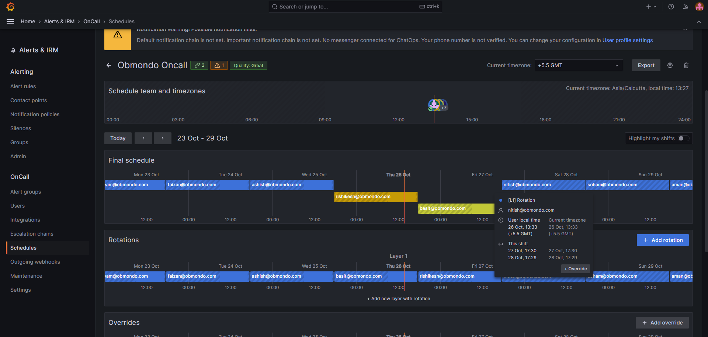

# Oncall

## Setup Oncall

- After syncing the oncall application

1. Open the oncall plugin and configure the grafana backend

    [URL](https://oncall.kbm.obmondo.com/grafana/plugins/grafana-oncall-app)

      ```text
      Add the backendurl as
      http://oncall-engine:8080
      ```

2. Inform all the members to sigin using keycloakx to have all the users .

## Restore Oncall

1. Copy the backup file to the psql pod
2. Restore users and schedule

    ```sh
    psql
    # Drops the database
    DROP DATABASE oncall;
    # Create Empty DB
    CRETE DATABASE oncall;
    ```

    - Now the DB is clean restore the DB using the commands

    ```sh
    psql -d oncall -U postgres < backup.sql

    # Reset the oncall password
    psql
    ALTER USER oncall WITH PASSWORD '<oncall user password which is in secrets>';
    ```

3. Kick the pods  `oncall-celery, oncall-grafana, oncall-engine` and wait for it to come back online .

4. Inform all the users to signin using keycloakx ,

## User Telegram setup

Prerequisites:

- Download the Telegram mobile app from Google Play Store/ Apple App Store.
- Install the Telegram Dekstop app on your PC or open [Telegram Web](https://web.telegram.org)

  ```console
  # Install telegram desktop
  sudo snap install telegram-desktop
  ```

- [For admins] Make sure that the user has correct role and access to Grafana.
  The access can be granted using Keycloak or your OIDC provider.

- Create an account on Telegram if you don't have one.
- Link the Telegram desktop with your mobile app by navigating to `Settings > Devices > Link Desktop Device`
- Scan the QR code and then your Telegram Desktop will be logged in too.

Setup Grafana Oncall with Telegram:

- Login to [Grafana](https://grafana.yourdomain.com)
- Open `Menu` from the top left icon from Grafana Dashboard\
- Navigate to `Alerts & IRM > Oncall > Users`
- Click on `Edit` button beside your username.
- Click on `Link Telegram Account`
- It will navigate to the link to your Telegram Bot.
- It should open in new tab and click on `Send Message` or it will prompt you to `Open Telegram Desktop`
- In the chat screen, click on `Send Message`
- You will receive a message like:
  
  ```raw
  Hi!
  This is Grafana OnCall notification bot. You can connect your Grafana OnCall account to Telegram on user settings page.
  ```

- Switch to Grafana and copy the generated code to link the account.
- Paste the code in the Telegram chat with the bot.
- Your account is now connected and you should get a message like:

  ```raw
  Done! This Telegram account is now linked to user@yourdomain.com 🎉
  ```

- Refresh the Grafana page and click again on Edit on your username and setup `Default Notications`
- Add the entry to `Notify By > Telegram` for the Default Notifications config
- Setup `Important Notifications`
- Add the entry to `Notify By > Telegram` for the Important Notifications config

## Using Grafana Oncall with Telegram

We have to create a Telegram Bot to allow Grafana Oncall to send messages.
Docs for creating a bot : https://core.telegram.org/bots#how-do-i-create-a-bot

## Telegram Template for on call

### Title

```jinja2
<b>{{ payload.labels.alertname }}</b>
```

### Body

```jinja2
<b>Title:</b> {{ payload.annotations.summary }}
<b>Description:</b> {{ payload.annotations.description }}
<b>Severity:</b> {{ payload.labels.severity }}
<b>Status:</b> {{ payload.status }}
<b>Start Time:</b> {{ payload.startsAt }}

<b>Labels:</b>


<b>{{ label }}:</b> <i>{{ payload.labels[label] }}</i>


```

## Shift Override

### Locate Overrides Section

The `Overrides` section is located below the main schedule rotations.
You can add overrides in this section to make one-time changes for specific shifts.

### Adjusting schedules for specific dates/swapping shifts

- Keep the Cursor on your name and the date you want to swap.
  It will open the option for Override, click on that.
- select the Employee from the drop-down menu with whom you have swapped and then save.
- Repeat the same steps with the Employee with whom you have swapped the day.


